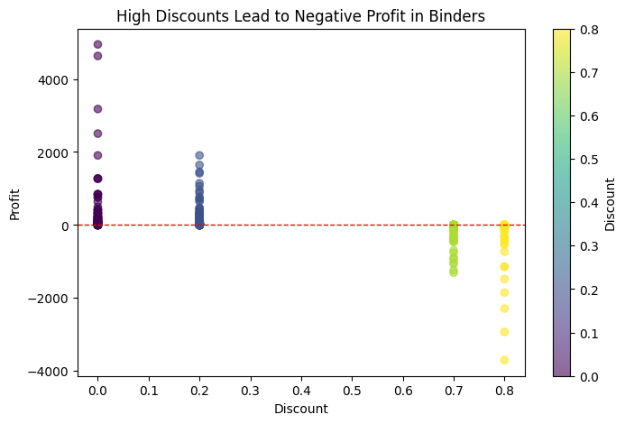

# Retail Sales Analysis in Python

## Overview
This project analyzes retail sales data using Python, focusing on data cleaning, exploratory data analysis (EDA), and business insights.  
The goal is to identify patterns in sales, discounts, and profitability to highlight areas that may require strategic review.

## Dataset
**Source:** Sample Superstore dataset  

- **Rows:** 9,994  
- **Columns:** 21  

### Key fields
- Order Date, Ship Date  
- Category, Sub-Category  
- Sales, Quantity, Discount, Profit  

Raw data is stored in `Data/Raw`, and the cleaned version (optional) in `Data/Processed`.

## Project Structure

```text
retail-sales-analysis-python/
│
├── Data/
│   ├── Raw/               # Original dataset
│   └── Processed/         # Cleaned dataset (optional)
│
├── notebooks/             # Jupyter notebooks (EDA & analysis)
├── reports/
│   └── figures/           # Generated visualizations
│
├── src/                   # Reserved for future modular code
├── README.md
└── LICENSE
```

## Analysis Steps
1. Loaded and inspected the dataset
2. Cleaned data and converted date columns
3. Performed exploratory data analysis (EDA)
4. Analyzed the impact of discounts on profitability
5. Identified sub-categories with consistent negative profit

## Key Insights
- High discount levels (≥ 70%) are strongly associated with negative profit in some sub-categories.
- The *Binders* sub-category shows repeated losses despite moderate order sizes.
- Discount strategy appears to be a stronger driver of losses than sales volume.

  ## Example Visualization



## Tools Used
- Python
- pandas
- matplotlib
- Google Colab

## Author
Estefanía Flores Ibarra
